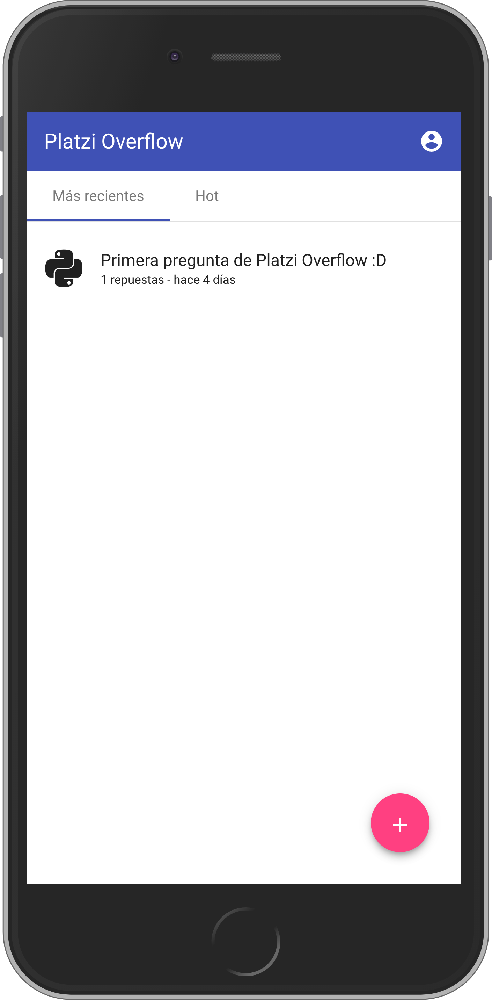

# Stack-Overflow built for platzi.com

This is an app created to simulate a Platzi's stack-overflow version with a Single Page Application (SPA).

It's built with Mongo DB, Express, Angular 6 and Node (MEAN stack)

## How does it works?

Node.JS 10 required

* `npm install` to install dependecies
* `npm run start` to start dev environment

## Licended

MIT
